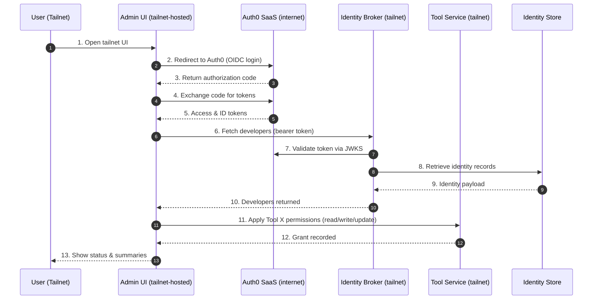

# Tailnet Identity Agent POC



_Diagram source: `docs/architecture.mmd`_

This proof of concept showcases Tailscale for AI agents/tooling and identity use cases. An administrator uses an Auth0-protected UI (or CLI agent) running on the tailnet to:

1. Authenticate via Auth0 (standard OIDC login) while the admin UI itself remains reachable only over the tailnet.
2. Query the identity broker (tailnet-only) for group membership.
3. Grant Tool X permissions (`toolx:read toolx:write toolx:update`) to every developer through the tailnet-only tool service.

The flow demonstrates secure, identity-aware automation across Tailscale-connected services.

## Components

| Path | Description |
|------|-------------|
| `cmd/identity-broker` | Auth0-validated API exposing `/v1/identity/*` endpoints (static fixtures or future Auth0 Mgmt API). |
| `cmd/tool-service` | Accepts Auth0 M2M tokens (`tool.access:grant`) and persists per-user Tool X permissions. |
| `cmd/agent` | CLI/Scheduled task that calls the broker/tool service. Supports `--grant-group developers` to apply permissions. |
| `cmd/admin-ui` | Tailnet-only web UI (Auth0 OIDC) that invokes the same grant workflow with a single button. |
| `internal/*` | Shared helpers for Auth0 validation, identity providers, and summarisation. |
| `infra/railway/*` | Dockerfiles, entrypoints, and env templates used for Railway deployment (also referenced by `docker-compose.yaml`). |
| `docs/*` | Deployment guide (`deploy-railway.md`), Auth0 reference (`auth0-config.md`), Mermaid diagram, future work, and ACL notes. |

## Local Development

1. **Install dependencies**
   ```bash
   go mod tidy   # generates go.sum if not present
   ```

2. **Copy env templates** (edit values before running):
   ```bash
   cp infra/railway/env-samples/broker.env.example     infra/railway/broker.env
   cp infra/railway/env-samples/tool-service.env.example infra/railway/tool-service.env
   cp infra/railway/env-samples/agent.env.example       infra/railway/agent.env
   cp infra/railway/env-samples/admin-ui.env.example    infra/railway/admin-ui.env
   ```

   Replace placeholders (`TAILSCALE_AUTHKEY`, Auth0 client IDs, etc.) with your own values.

3. **Run the stack**
   ```bash
   docker compose --env-file infra/railway/broker.env \
                  --env-file infra/railway/tool-service.env \
                  --env-file infra/railway/agent.env \
                  --env-file infra/railway/admin-ui.env \
                  up --build
   ```
   > The Railway Dockerfiles start `tailscaled`; local runs require valid auth keys with MagicDNS access.

4. **Unit tests**
   ```bash
   make test
   ```

## Deploying to Railway

1. Build & push images (creates four tags under your Docker Hub account):
   ```bash
   scripts/build_push_all.sh <dockerhub-username>
   ```
2. Follow `docs/deploy-railway.md` to create four Railway services from those images. Use the matching env templates in `infra/railway/env-samples/` when filling out variables.
3. After deploy, visit `http://admin-ui.<tailnet-domain>/`, grant Tool X permissions, and confirm `http://tool-service.<tailnet-domain>:8090/access/list` reflects the new entries.

## Auth0 & Tailscale Configuration

- Auth0 setup (API + M2M + Regular Web App) is documented in `docs/auth0-config.md`.
- Tailscale tag ownership and ACL examples are in the same doc and in the Railway guide.

## Makefile & Scripts

- `make test` – run Go tests with a local build cache.
- `make compose-up` / `make compose-down` – convenience wrappers around `docker compose`.
- `make push-images DOCKER_USER=<dockerhub-user>` – shorthand for the Docker Hub publish script.
- `scripts/build_push_all.sh` – builds all four containers and pushes them to Docker Hub.

## What’s Next

- Swap the static identity fixture with live Auth0 Management API calls.
- Add CI and automated linting/tests.
- Expand Tool X permissions (revoke, audit) and integrate with MCP to demonstrate AI tooling APIs.
- Enabling HTTPS for all service using tailnet

For a deeper dive into deployment or configuration, consult:
- `docs/deploy-railway.md`
- `docs/auth0-config.md`
- `FUTURE_PLAN.md`

This repository now serves as a concise demonstration of Tailscale-secured identity automation: Auth0-protected control plane, brokered identity data, and Tool X permission grants executed entirely over the tailnet.
